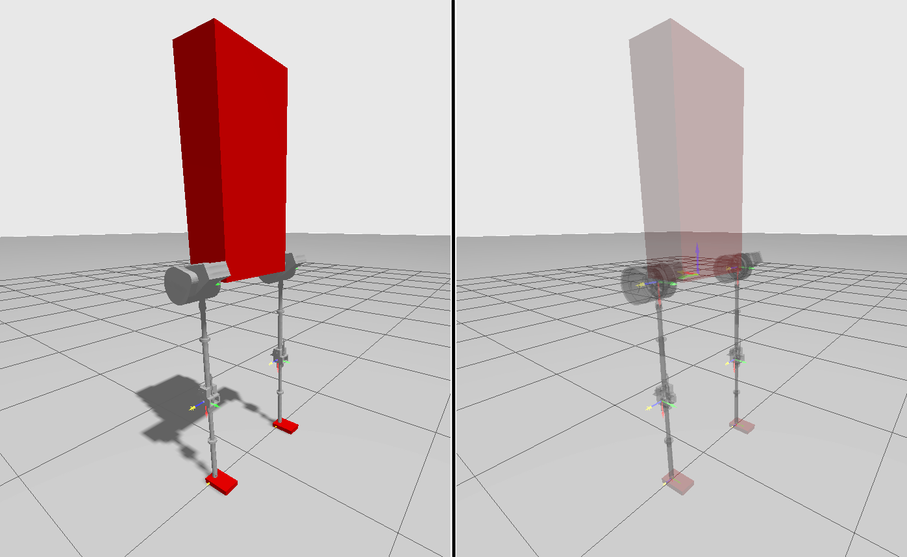

# 🦿 Exoskeleton ROS2 Project

Special thanks to Max Lewter [LLEAP](https://github.com/MaxLewter16/LLEAP)

This project implements a **ROS-2 Humble based control framework for a powered hip-knee–ankle exoskeleton** using both **phase-variable control** and **neural network–based gait prediction**.  
It integrates **simulation**, **control**, and **visualization** in Gazebo, MoveIt, and RViz for research on human gait and robotic prosthesis control.


## 🧩 Packages

### `exo_description`
- Contains the URDF/Xacro model of the exoskeleton.
- Includes meshes, joint definitions, and physical properties.
- Used by both Gazebo and MoveIt for kinematic simulation.
- Launch files load the model into robot_state_publisher.

### `exo_gazebo`
- Provides the Gazebo simulation environment for the exoskeleton.
- Launch files start Gazebo with exoskeleton model.

### `exo_control`
- Core control package containing ROS2 nodes and neural network models for phase-variable and timestamp-based control.
- Implements gait trajectory generation and joint actuation based on learned CNN/LSTM models.
- Includes ros2_controller.yaml for controller configuration:
    - trajectory_controller
    - joint_state_broadcaster
- Includes all neural network parameters (models, scalers, and data) used in nodes

### `exo_moveit` (Needs Work)
- Contains MoveIt2 configuration for motion planning and visualization.
- Provides joint groups for both legs and motion planning parameters.
- Used for kinematic checks, workspace analysis, and offline trajectory generation.

### `exo_rviz` (Needs Work)
- Visualization package to launch RViz2 with predefined configurations:
- Displays joint states and trajectories in real time.
- Supports monitoring of neural-network-based motion predictions.


## 🚀 Launching:
``` 
colcon build
source install/setup.bash
```
```
ros2 launch exo_gazebo gazebo.launch.py
```
```
ros2 launch exo_control joint_publisher.launch.py       # Launches neural-network node
```
or
```
ros2 launch exo_control joint_publisher_pv.launch.py    # Launches phase-variable node
```
---


## 🧰 Key files:
| File | Description |
|------|--------------|
| `joint_publisher_nn.py` | Publishes predicted joint trajectories from a model (LSTM, CNN) to `/trajectory_controller/joint_trajectory`. |
| `joint_publisher_pv.py` | Publishes predicted joint trajectories from model with phase variable computation to `/trajectory_controller/joint_trajectory`. |
| `data_publisher.py` | Publishes patient data on exoskeleton for vizualization purposes. |
| `ros2_controller.yaml` | Defines Gazebo joint controllers. |
---


## 🧠 Neural Network Files
The exo_control package uses **TensorFlow/Keras** models trained from gait datasets.

### Models
- `Timestamp_lstm_model.keras` — LSTM for timestamp-based  gait prediction  
- `Timestamp_cnn_model.keras` — CNN for timestamp-based trajectory prediction  
- `PV_lstm_model.keras` — LSTM for phase-variable gait prediction  
- `PV_cnn_model.keras` — CNN for phase-variable gait prediction  

### Scalers
- `standard_scaler_typical_lstm.save` — LSTM Scaler for typical patients
- `standard_scaler_typical_cnn.save` — CNN Scaler for typical patients
- `standard_scaler_cp_lstm.save` — LSTM Scaler for cerebral palsy patients
- `standard_scaler_cp_cnn.save` — CNN Scaler for cerebral palsy patients

### Excel files
- Associated `.xlsx` files store predicted joint angles used in initial states.
---


## ⚙️ ROS2 Topics

| Topic | Message Type | Description |
|-------|---------------|-------------|
| `/joint_states` | `sensor_msgs/JointState` | Joint feedback from Gazebo controllers |
| `/trajectory_controller/joint_trajectory` | `trajectory_msgs/JointTrajectory` | Position controller for both exoskeleton legs |
| `/phase_variable_left` | `std_msgs/Float32` | Left leg phase variable |
| `/phase_variable_right` | `std_msgs/Float32` | Right leg phase variable |
---


For more information about the NN models and preprocessing of the datasets please look at the project [Neural-Networks-For-Gait-Analysis-and-Prediction](https://github.com/Evangelos-Karavas/Neural-Networks-For-Gait-Analysis-and-Prediction)
