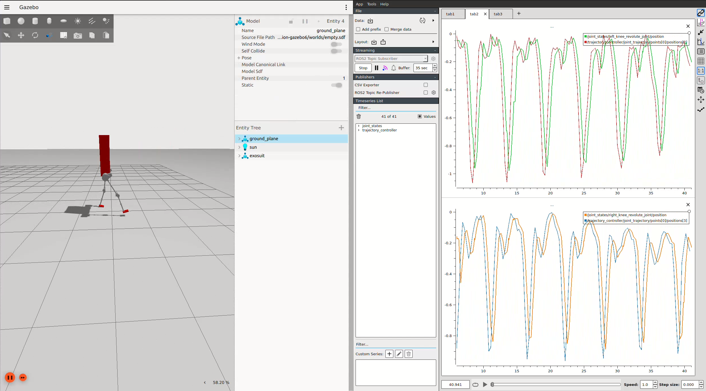

# 🦿 Exoskeleton ROS2 Project

Special thanks to Max Lewter [LLEAP](https://github.com/MaxLewter16/LLEAP) and March exoskeleton [Project March](https://github.com/project-march/ProjectMarch) which were used for details about models joint limits, inertias, and stl files.

This project implements a **ROS2 Humble-based control framework for a powered hip-knee-ankle exoskeleton** using both **phase-variable control** and **neural network-based gait prediction**.   It integrates **simulation**, **control**, and **visualization** in Gazebo, MoveIt, and RViz for research on human gait and robotic prosthesis control.




## 🧩 Packages

### `exo_description`
- Contains URDF/Xacro model definitions for the exoskeleton.
- Includes meshes, joint limits, physical parameters, and material colors.
- Provides ROS2 Control extensions for Gazebo simulation.

### `exo_gazebo`
- Simulation environment for the exoskeleton in Gazebo.
- Launch files: `gazebo.launch.py`, `march_gazebo.launch.py`

### `exo_control`
- Core control package with ROS2 nodes for phase-variable and neural network-based control.
- **Key nodes:**
    - `joint_publisher_nn.py` — NN-based trajectory generation (LSTM/CNN)
    - `joint_publisher_pv.py` — Phase-variable trajectory generation
    - `data_publisher.py` — Patient data visualization
    - `foot_contact_bool.py` — Foot contact detection
- **Controller configuration:** `ros2_controller.yaml`
- **Neural network parameters:** Pre-trained models, scalers, and training data

### `exo_moveit`
- MoveIt2 configuration for motion planning and kinematic analysis.
- Joint groups, collision geometry, and motion planning parameters.
- Launch files for move group, RViz visualization, and controller spawning.

### `exo_rviz`
- RViz2 visualization configurations for real-time monitoring.
- Displays joint states, trajectories, and neural network predictions.

### `misc`
- PlotJuggler configurations and CSV data for trajectory visualization.
- Helper scripts for data analysis and plotting.

## 🚀 Quick Start
```bash
colcon build
source install/setup.bash
```

**Launch Gazebo simulation:**
```bash
ros2 launch exo_gazebo gazebo.launch.py
```

**Launch neural network control:**
```bash
ros2 launch exo_control joint_publisher.launch.py
```

**Or launch phase-variable control:**
```bash
ros2 launch exo_control joint_publisher_pv.launch.py
```

---

## 🧰 Key Files
| File | Description |
|------|--------------|
| `joint_publisher_nn.py` | Publishes NN-predicted joint trajectories using timestamps to `/trajectory_controller/joint_trajectory` |
| `joint_publisher_pv.py` | Publishes NN-predicted joint trajectories using the phase variable approach to `/trajectory_controller/joint_trajectory` |
| `data_publisher.py` | Publishes patient data for visualization |
| `ros2_controller.yaml` | Gazebo controller and broadcaster configuration |

---

## ⚙️ ROS2 Topics
| Topic | Message Type | Description |
|-------|---------------|-------------|
| `/joint_states` | `sensor_msgs/JointState` | Joint feedback from Gazebo |
| `/trajectory_controller/joint_trajectory` | `trajectory_msgs/JointTrajectory` | Command trajectory for exoskeleton |
| `/phase_variable_left` | `std_msgs/Float32` | Left leg phase variable |
| `/phase_variable_right` | `std_msgs/Float32` | Right leg phase variable |
| `/right_sole/in_contact` | `std_msgs/Bool` | Right sole contact Boolean (True or False) |
| `/left_sole/in_contact` | `std_msgs/Bool` | Left sole contact Boolean (True or False) |
---

## 🧠 Neural Network Models
Located in `neural_network_parameters/models/`:
- `Timestamp_lstm_model.keras` — LSTM timestamp-based prediction
- `Timestamp_cnn_model.keras` — CNN timestamp-based prediction
- `PV_lstm_model.keras` — LSTM phase-variable prediction
- `PV_cnn_model.keras` — CNN phase-variable prediction

**Scalers** (in `neural_network_parameters/scaler/`):
- `standard_scaler_typical_*.save` — Typical patient scalers
- `standard_scaler_cp_*.save` — Cerebral palsy patient scalers
- `scaler_angles_*.save` — Joint angle scalers
- `scaler_pv_*.save` — Phase-variable scalers
---

For more information on neural network models and dataset preprocessing, see [Neural-Networks-For-Gait-Analysis-and-Prediction](https://github.com/Evangelos-Karavas/Neural-Networks-For-Gait-Analysis-and-Prediction).
